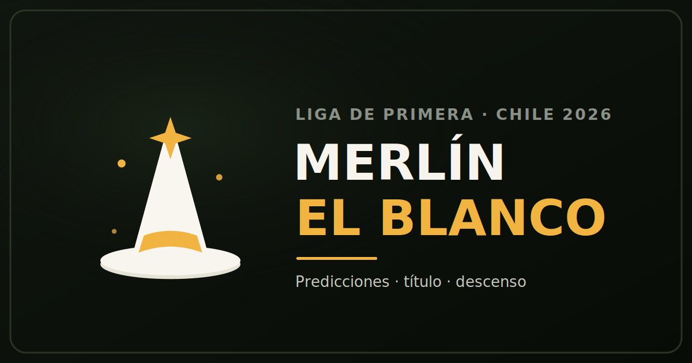

<p align="center">
  
</p>

<h1 align="center">Merlín el Blanco</h1>

<p align="center">
  Modelo probabilístico independiente para la <b>Liga de Primera de Chile 2026</b>.<br>
  Predice partidos, la carrera por el título, el descenso y la proyección de temporada — con honestidad sobre lo que puede y no puede hacer.
</p>

<p align="center">
  <a href="https://playlikeagirl.github.io/merlin_albo/"></a>
  
  
  
</p>

<p align="center"><b><a href="https://playlikeagirl.github.io/merlin_albo/">▶ Abrir la app</a></b></p>

---

## Qué es

**Merlín el Blanco** es un modelo cuantitativo que estima probabilidades para cada partido y para el desenlace de la temporada del fútbol chileno. La regla de oro del proyecto: **ser honesto** — el modelo estima probabilidades, no adivina resultados.

## Características

- **Predicciones de la fecha para los 3 equipos en carrera** — probabilidad de local / empate / visita de la fecha siguiente, con goles esperados (xG), ambos marcan y over/under.
- **Panel de partido destacado CC** — matriz completa de marcadores posibles para CC (6×6), marcadores más probables y otras posibilidades, estimado con **1.000.000 de simulaciones**.
- **Carrera por el título** — probabilidad de campeón y la aritmética completa: diferencia de puntos, puntos en disputa, cuánto le falta al líder y el margen de cada perseguidor.
- **Simulador interactivo** — elegí los resultados de las 8 fechas restantes (incluidos los duelos directos entre candidatos) y mirá cómo evoluciona la carrera fecha a fecha.
- **Descenso y proyección** — probabilidad de descender y rango de puntos finales (p10–p90).
- **Modelo vs Mercado** — dónde el modelo coincide o discrepa con las casas.
- **PWA instalable** · **modo claro / oscuro**.

## Cómo funciona

El motor sigue la cadena clásica de modelado de fútbol:

1. **Ratings Elo** construidos con resultados históricos (2018–2026).
2. **Goles esperados** por equipo (ataque / defensa), usando la forma local y visita real.
3. **Poisson bivariado con corrección de Dixon-Coles** (rho ~ 0 en datos chilenos) para la distribución de marcadores.
4. **Simulación de Monte Carlo** de la temporada — de cientos de miles a más de un millón de iteraciones — partiendo de la tabla oficial.

### Honestidad primero

El modelo **estima probabilidades, no adivina resultados**. En backtest fuera de muestra logra un log-loss competitivo, pero **no le gana a las cuotas de cierre** del mercado — y la diferencia es *estructural* (no ve alineaciones, lesiones ni estado de la cancha), no un problema de ajuste. Cuando esa información existe, se agrega como un ajuste manual claramente etiquetado, fuera del modelo validado.

> Cuando la app dice "46%", está diciendo *esto está peleado*, no *esto va a pasar*.

**Esto no es consejo de apuestas.**

## Stack

| Capa | Tecnología |
|---|---|
| Motor | Python (Elo · Dixon-Coles · Monte Carlo con NumPy) |
| Frontend | HTML + CSS + JavaScript, sin frameworks |
| App | PWA instalable con service worker (uso offline) |
| Hosting | GitHub Pages |

## Datos

- Tablas y estadísticas oficiales: **FootyStats**
- Dataset histórico: **schochastics/football-data** (licencia ODC-BY)
- La tabla se reconcilia contra las fuentes oficiales en cada actualización.

## Estructura

```
index.html          · la app completa (frontend)
scripts/            · lógica JS
icons/              · íconos de la PWA + preview social
manifest.json       · manifiesto PWA
service-worker.js   · caché offline
```

## Instalar como app

En el celular: abrí la [web](https://playlikeagirl.github.io/merlin_albo/) y elegí **"Agregar a la pantalla de inicio"**. En el escritorio: el ícono de instalar en la barra de direcciones.

## Descargo

Proyecto **independiente**, sin relación con la ANFP ni con ningún club. El logo está **inspirado** en la temporada chilena y en la figura de Merlín, pero es un diseño original — no reproduce marcas registradas. Las predicciones son estimaciones probabilísticas con fines informativos y de entretenimiento. **No es consejo de apuestas.**

## Créditos

Diseño inspirado en [The Open Model](https://theopenmodel.com); **motor, construcción y datos, propios**. Licencia [MIT](LICENSE).
